# 🏎️ 2025 F1 Analysis Dashboard 🏎️

## Project Overview
This dashboard provides deep analysis into the 2025 Formula One season, tracking driver performance across the season, constructor battles, and teammate head-to-head comparisons.

## Formula One Introduction
Formula One, known as F1, is often referred to as the pinnacle of motorsport. 10 teams with 2 drivers each, for a total of 20 drivers, compete for two different championships: the drivers' and the constructors' championships. The teams race across 24 tracks across the world throughout the year, with each race awarding championship points to the drivers and teams based on where they finish. 

Each race weekend is split into three days: Friday, Saturday, and Sunday (Thursday, Friday, and Saturday for the Las Vegas Grand Prix). On a regular weekend, Friday consists of two practice sessions, Saturday consists of one practice session and qualifying, while Sunday consists of the main race. This is altered during sprint weekends, which are special weekends that occur 6 times during the year, where there is a sprint race added to the weekend, which is a mini race that awards a maximum of 8 points to the winner. Sprint weekends consist of one practice session and sprint qualifying on Friday, the sprint race and regular qualifying on Saturday, and the main race on Sunday. 

The way qualifying works is that it is split into three parts (Q1, Q2, and Q3). All 20 drivers take part in Q1, with the objective being to set the fastest time possible. The 5 slowest drivers are eliminated after Q1, with the remaining 15 proceeding to Q2. Once again, the 5 slowest drivers are eliminated after Q2, with the remaining 10 proceeding to Q3. This is the final part, and this sets the final order for the top 10, awarding the driver with the fastest time pole position, which means they start at the front of the grid for the race. As drivers are eliminated in Q1 and Q2, they are placed into positions based on their times. 

For the race, the drivers are positioned based on qualifying. The races award the points for the championship with the following distribution:

1st - 25 points

2nd - 18 points

3rd - 15 points

4th - 12 points

5th - 10 points

6th - 8 points

7th - 6 points

8th - 4 points

9th - 2 points

10th - 1 point

11th-20th - 0 points

These points accumulate across the season, and at the end of the 24 races, the driver and the team with the most points win their respective championships. In 2025, Lando Norris of Mclaren won the drivers' championship with 423 points. Mclaren also won the constructors' championship with 833 points between drivers Lando Norris and Oscar Piastri. 

## Technical Stack
- **Power BI:** Data modeling and visuals.
- **Excel:** Data source and relational storage. Created by me, includes 5 tables with information found on the F1 website, used to form the data that is displayed.
- **DAX:** Engineered custom measures to colour-code, calculate accurate driver ages, create disappearing titles, and find averages.

## Dashboard 
- **Title Page** 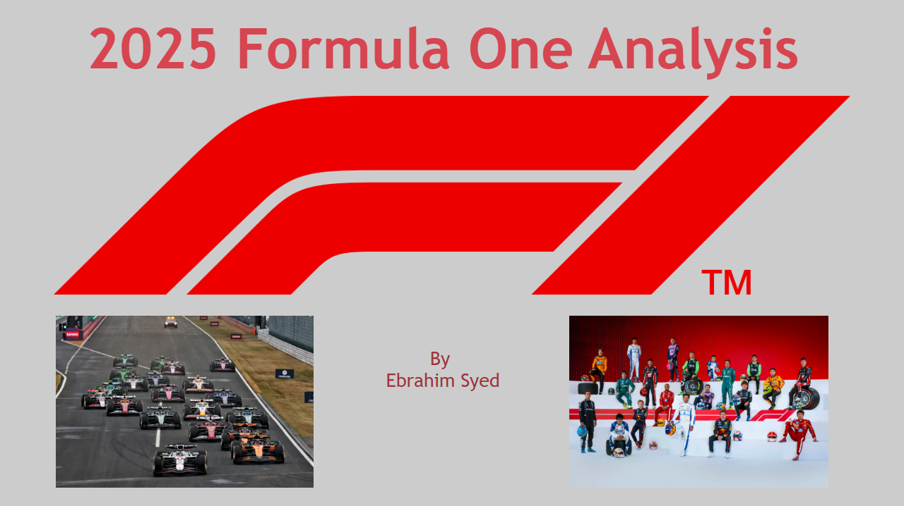
- **Constructors** 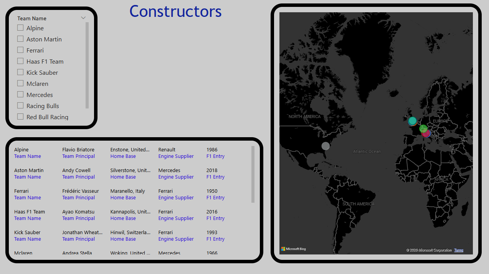 The first page includes information regarding all 10 constructors. Information includes team name, team principal, team engine supplier, home base, and F1 entry. Also included is a map that shows where the home base is geographically located.
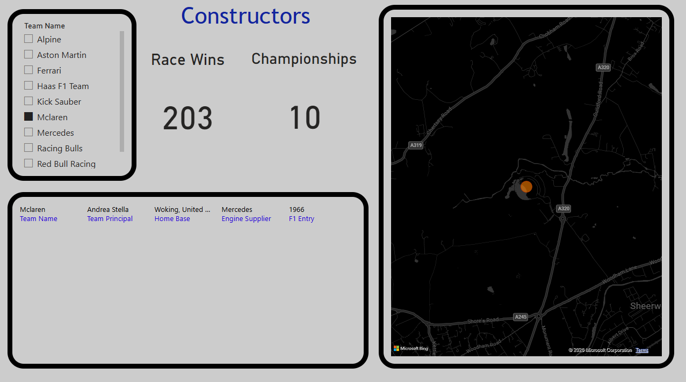 Additionally, a slicer allows users to select a specific team, which then only shows information regarding that team, and the map zooms into the team's home base location.
- **Drivers** 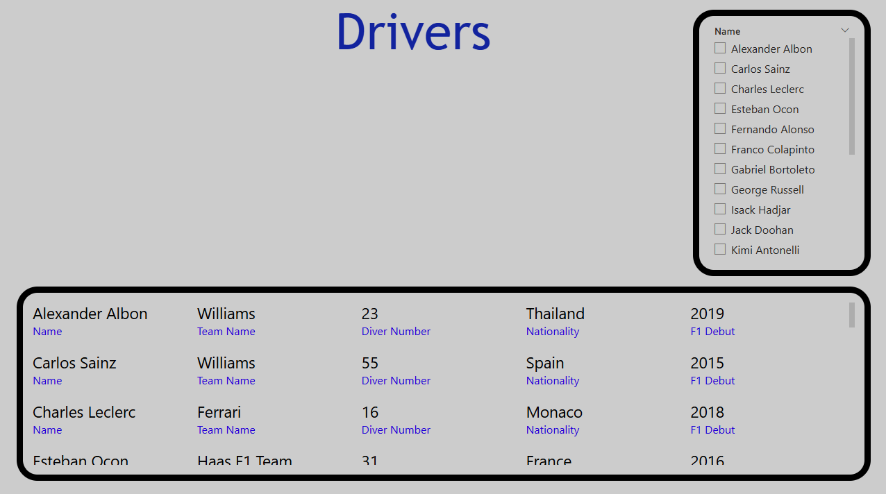 The second page provides information regarding the 21 drivers (Jack Doohan replaced by Franco Colapinto mid-season). The information includes name, nationality, driver name, the driver's team, and their F1 Debut.
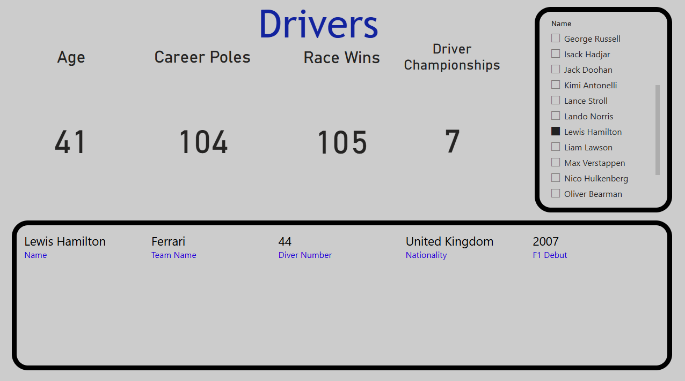 As with the constructors, a slicer allows users to select drivers, viewing information only regarding them. New information provided includes the driver's age, career pole positions count, career race wins count, and career driver championships count.
- **Circuits** 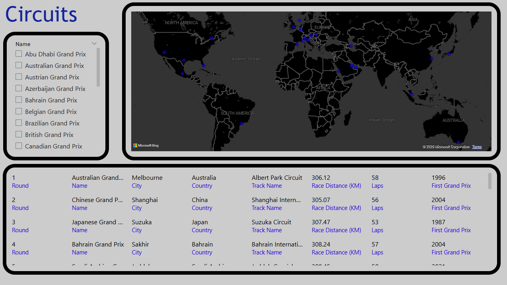 The next page shows information regarding the 24 circuits on the 2025 F1 calendar. Information included is the round the race takes place, the city and the country the circuit is located in, the track and race name, the number of laps and race distance of the circuit, and the year the first grand prix was hosted at that circuit. A map is also included that shows where the circuits are located across the world.
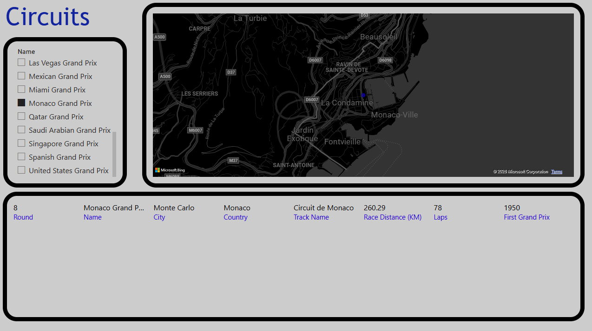 When a circuit is chosen using the slicer, only information regarding that circuit is displayed, and the map zooms into the circuit location.
- **Standings** 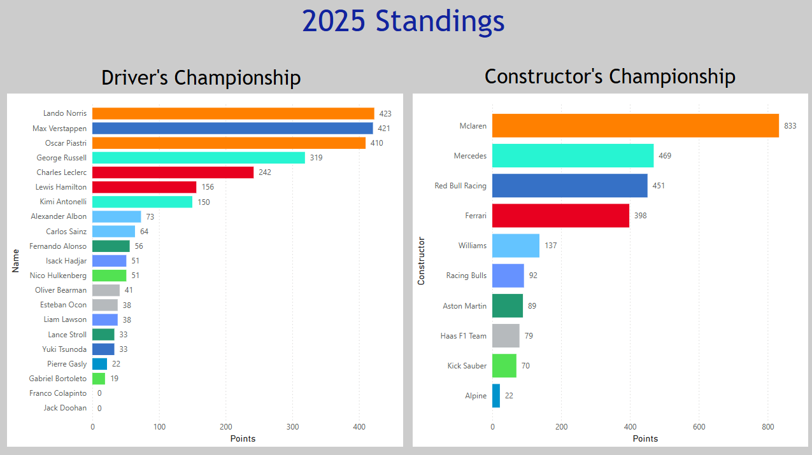 Displays the 2025 Drivers' and Constructors' championship standings. Uses a clustered bar chart to display all the drivers and constructors. All drivers and constructors are represented by their team's colours, done through a custom DAX measure that assigned colours to teams, which were connected to drivers.
- **Constructor Standings Progression** 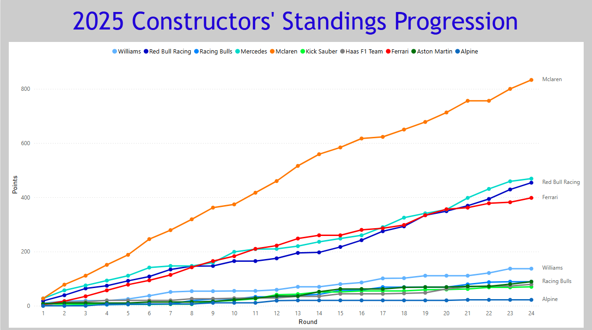 Displays the progression round-by-round of the constructors' championship standings. Uses a line chart to show the progression across the rounds, with dotted markers to show each round.
- **Driver Standings Progression** 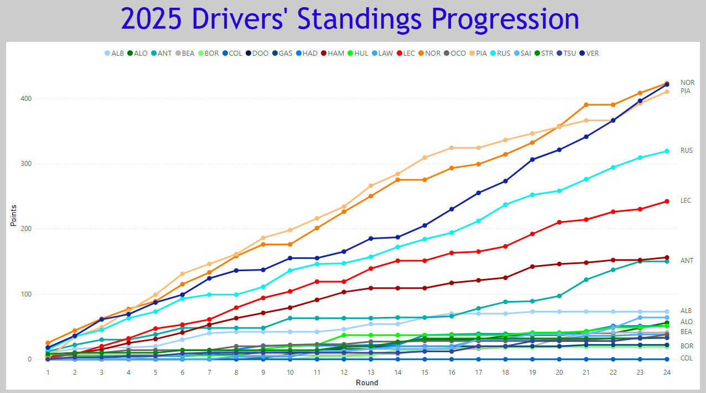 Displays the progression round-by-round of the driver' championship standings.
- **Season Averages** 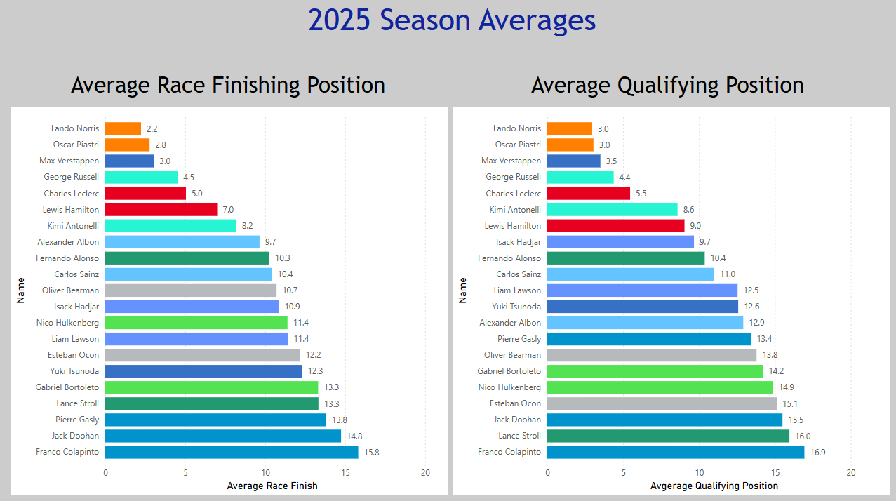 This page displays the average race finish position and the average qualifying position of each driver. Uses a clustered bar chart to show the best to worst averages from the drivers.
- **Race Head-to-Head** 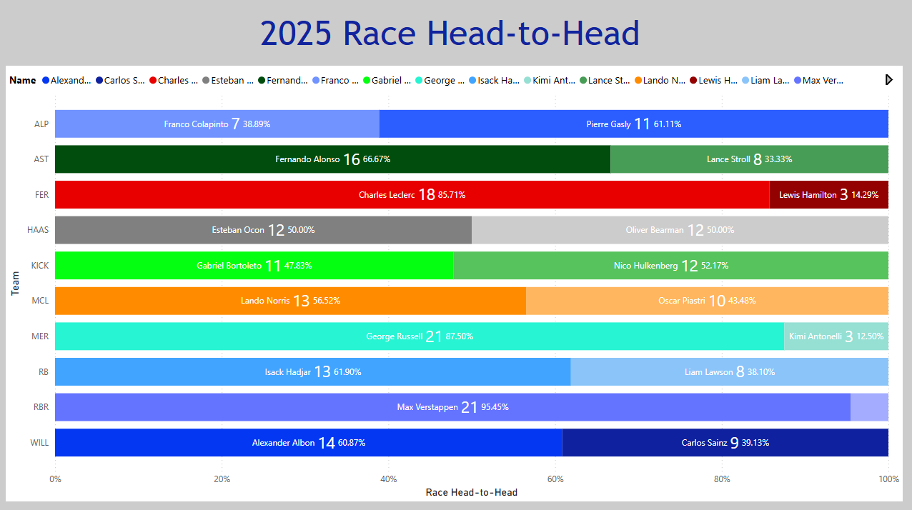 This page shows the race head-to-heads between teammates. Shows which drivers outperformed their teammates across race finishes. Uses a 100% stacked bar chart to display the percentage of each driver's head-to-head with their teammate. Jack Doohan is not included, and Red Bull and RB's head-to-heads are accurate after the mid-season swap of Liam Lawson and Yuki Tsunoda.
- **Qualifying Head-to-Head** 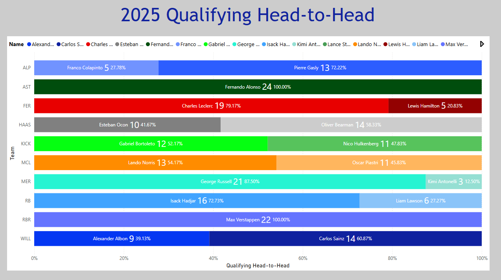 This page shows the qualifying head-to-heads between teammates. Shows which drivers outperformed their teammates across qualifying. Jack Doohan is not included, and Red Bull and RB's head-to-heads are accurate after the mid-season swap of Liam Lawson and Yuki Tsunoda.
- **Winners & Pole Positions** 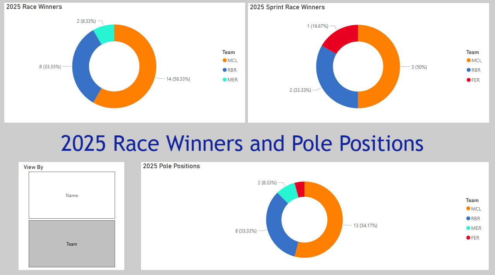 Displays the race winners, sprint race winners, and pole positions across the season in donut charts. Allows users to swap between winning drivers and constructors.
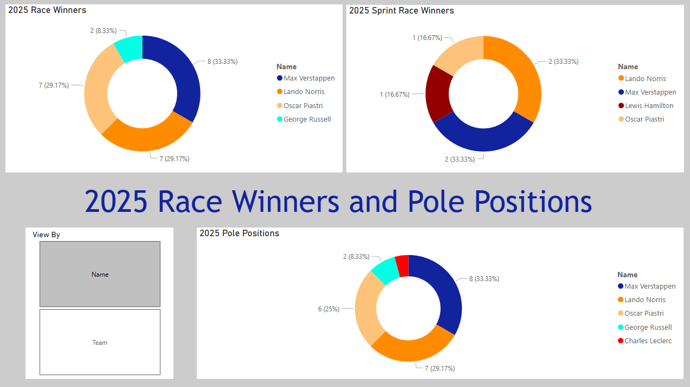

## Analysis
- In the constructors' championship, Mclaren absolutely dominated with a gap of 364 points to second-place Mercedes. The battle for 2nd was interesting between Mercedes, Red Bull, and Ferrari, with the 3 teams being split by 71 points. Across the season, Mclaren got an early lead and never looked back, while the other 3 battled all season, swapping places regularly. 
- In contrast, the drivers' championship was very close, with Lando Norris only beating Max Verstappen by 2 points, and the gap between 1st and 3rd being only 13 points. Lando, Max, and Oscar Piastri went into the final race neck and neck, with each driver still being able to win the championship. Despite Max winning, Lando's championship lead was too large, and a 3rd place finish was enough to crown him champion. Across the season, Oscar Piastri led the championship for the majority of the season, after taking the lead from his teammate in round 5. However, Piastri had a rough second half of the season and lost the lead to his consistent teammate Lando. In the background, Max started dominating the late races, charging back from far behind to enter the championship battle, impressively finishing second in the championship, despite being 104 points off 1st place at a point in the season.
- The top 3 were the most consistent drivers on the grid, with Lando having an average finishing position of 2.2, Oscar with 2.8, and Max with 3.0. Similarly, Lando had an average qualifying position of 3.0, matched by Oscar, with Max at 3.5. While Lando wasn't as competitive as his teammate in the first half, his consistency allowed him to stay in the championship fight, taking full advantage of Oscar's drop in form.
- Also impressive were George Russell and Charles Leclerc, who did most of the heavy lifting for their teams, with teammates rookie Kimi Antonelli and struggling legend Lewis Hamilton, respectively.
- Red Bull, Ferrari, Aston Martin, and Mercedes had one-way race head-to-heads, with Max, Charles, Fernando Alonso, and George having the majority of the higher race finishes over their teammates. In contrast, Haas, Kick, and Mclaren had close battles between their drivers.
- In qualifying head-to-heads, Max and Fernando clean-swept their teammates, 22-0 and 24-0, respectively, while George and Charles also performed significantly better. Once again, Haas, Kick, and Mclaren had close battles.
- An interesting team is Williams. While Alex Albon beat teammate Carlos Sainz 14-9 in race head-to-heads, Sainz beat Albon 14-9 in qualifying head-to-heads. While Sainz was the better qualifier, Albon was able to perform better in the races.
- Mclaren had the most race wins (14), pole positions (13) and sprint wins (3). In terms of drivers, Max had the most race wins (8), pole positions (8), and was tied with Lando for most sprint race wins (2). This shows that Lando and Oscar, having 7 wins each, helped Mclaren beat any challenger. If Red Bull had a dynamic like Mclaren , with 2 drivers winning races, the constructors' championship could have been closer.

## Credits
All Formula One statistics and information provided by the official Formula One website: 
https://www.formula1.com/

Map locations and coordinates provided by Google Maps:
https://www.google.com/maps
  
